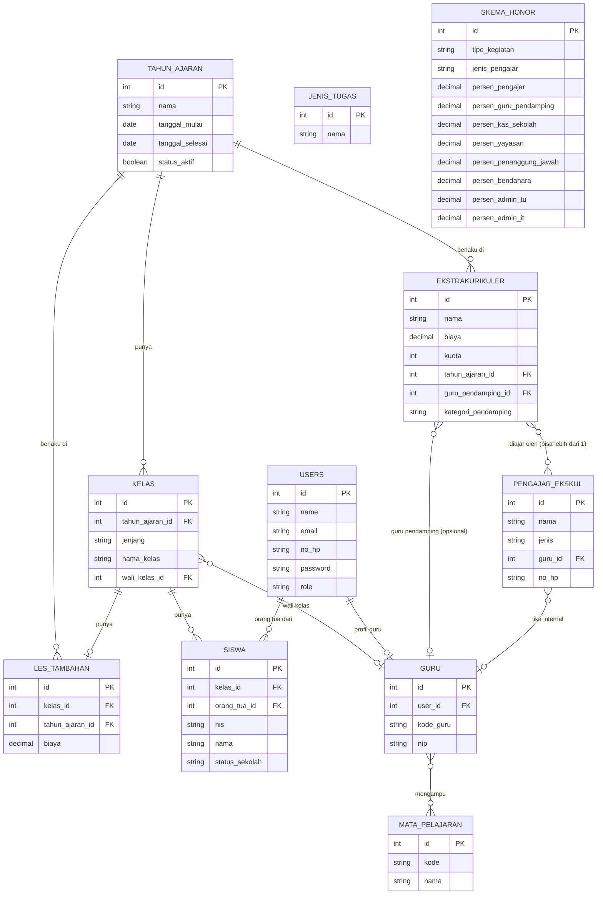

# Product Requirement Document (PRD)
## Aplikasi Jurnal Guru, Jadwal Guru, dan Les Tambahan & Ekstrakurikuler
**Klien:** SD Plus Gembala Baik — Yayasan Pendidikan Gembala Baik, Pontianak
**Versi:** 1.1 — menambahkan fitur Pembagian Honor (Kepala Sekolah)
**Tanggal:** 16 September 2026
**Tim Pengembang:** 2 orang (pembagian modul dijelaskan di Bagian B)

---

# BAGIAN A — FONDASI BERSAMA

## A1. Latar Belakang & Tujuan

Yayasan Pendidikan Gembala Baik saat ini menjalankan beberapa proses secara manual di SD Plus Gembala Baik:

- Pencatatan transaksi harian & rekap bulanan untuk les tambahan dan ekstrakurikuler masih menggunakan buku tulis dan Excel terpisah.
- Verifikasi pembayaran transfer dilakukan lewat chat pribadi antar staf, rawan bukti transfer hilang atau tidak terkirim.
- Pendaftaran les tambahan & ekstrakurikuler menggunakan Google Form, rawan pendaftaran dobel dan sulit melacak revisi data.
- Belum ada kanal resmi bagi guru untuk menyampaikan masukan/keluhan ke kepala sekolah.
- Sistem jadwal mengajar guru dari vendor sebelumnya hanya mendukung jam mengajar utama, tidak mendukung jam piket dan jam damping.

Tujuan aplikasi ini adalah mendigitalisasi keempat proses di atas dalam satu sistem terpadu, dengan validasi otomatis untuk mengurangi kesalahan pencatatan manual.

## A2. Ruang Lingkup

**4 modul utama:**

| Modul | Deskripsi Singkat | Penanggung Jawab |
|---|---|---|
| Les & Ekstrakurikuler | Pendaftaran + pencatatan transaksi & rekap bulanan | Pengembang 1 |
| Jurnal Guru | Forum privat guru–kepala sekolah + lihat jadwal pribadi | Pengembang 1 |
| Jadwal Guru | Kisi-kisi tugas mengajar + penjadwalan (utama, piket, damping) | Pengembang 2 |

**Out of scope untuk versi ini:**
- Pembayaran langsung di aplikasi (payment gateway) — direncanakan fase berikutnya
- Notifikasi real-time / chat langsung pada forum guru
- Auto-scheduling untuk jam piket & damping (cukup manual di versi ini)
- Honor flat untuk kegiatan non-les/ekskul (Pramuka, Bina Karakter, Olimpiade) — dibiayai dari kas sekolah terpisah, penerima ditentukan manual oleh Kepala Sekolah secara luring; tidak memakai skema persentase dan tidak tercakup di versi ini

## A3. Role & Permission

| Role | Les & Ekskul – Pendaftaran | Les & Ekskul – Transaksi | Les & Ekskul – Honor | Jurnal Guru | Jadwal Guru |
|---|---|---|---|---|---|
| **Kepala Sekolah** | Lihat semua | Lihat laporan (read-only) | Atur skema persen honor, tentukan guru pendamping per ekstrakurikuler, lihat rekap honor & tandai "Sudah Diketahui" | Lihat & balas semua thread | Lihat semua jadwal |
| **TU** | Input & kelola pendaftaran | Input transaksi, ajukan laporan untuk approval | – | – | – |
| **Bendahara** | – | Approve laporan harian & bulanan | Approval bulanan memicu perhitungan honor otomatis; tidak ada input manual dari Bendahara di sini | – | – |
| **Guru** | – | – | – | Kirim pesan privat ke kepala sekolah, lihat thread sendiri | Lihat jadwal mengajar sendiri |
| **Orang Tua** | Daftarkan anak, lihat status pendaftaran | Lihat status pembayaran & tunggakan anak | – | – | – |

## A4. Data Master Bersama & ERD Awal

**Entitas inti:**

- **users** — id, name, email (nullable, untuk staf), no_hp (username untuk role orang_tua), password, role (kepala_sekolah / tu / bendahara / guru / orang_tua)
- **guru** — id, user_id (FK), kode_guru, nip
- **mata_pelajaran** — id, kode, nama
- **guru_mata_pelajaran** *(pivot N–N)* — guru_id, mapel_id
- **tahun_ajaran** — id, nama, tanggal_mulai, tanggal_selesai, status_aktif
- **kelas** — id, tahun_ajaran_id (FK), jenjang, nama_kelas, wali_kelas_id (FK → guru)
- **siswa** — id, kelas_id (FK), orang_tua_id (FK → users), nis, nama, status_sekolah (aktif/pindah_sekolah/lulus)
- **jenis_tugas** — id, nama (Mengajar Utama, Piket, Damping) — dipakai oleh Modul Jadwal Guru
- **les_tambahan** — id, kelas_id (FK), tahun_ajaran_id (FK), biaya *(pengajar = wali_kelas dari kelas terkait, tidak disimpan terpisah; tanpa kolom kuota)*
- **ekstrakurikuler** — id, nama, biaya, kuota, tahun_ajaran_id (FK), guru_pendamping_id (FK → guru, nullable), kategori_pendamping (seni/olahraga, nullable — diisi manual oleh Kepala Sekolah per kegiatan)
- **pengajar_ekskul** — id, nama, jenis (internal/eksternal), guru_id (FK → guru, nullable), no_hp
- **ekstrakurikuler_pengajar** *(pivot N–N)* — ekstrakurikuler_id, pengajar_ekskul_id *(satu kegiatan bisa punya lebih dari 1 pengajar, mis. English Club 6 orang; honor pengajar dibagi rata sesuai jumlah baris di sini)*
- **skema_honor** — id, tipe_kegiatan (ekstrakurikuler/les_tambahan), jenis_pengajar (internal/eksternal, nullable — khusus ekstrakurikuler), persen_pengajar, persen_guru_pendamping (nullable), persen_kas_sekolah, persen_yayasan (nullable — khusus les_tambahan), persen_penanggung_jawab, persen_bendahara, persen_admin_tu, persen_admin_it *(dikelola Kepala Sekolah, bisa diubah kapan saja; perubahan hanya berlaku untuk perhitungan bulan berikutnya karena bulan yang sudah dihitung tersimpan sebagai snapshot — lihat `honor_kegiatan` di B.1)*

**ERD:**

*Catatan: `jenis_tugas` belum dihubungkan ke entitas lain di ERD ini karena tabel yang menggunakannya (alokasi piket, alokasi damping, jadwal mengajar) adalah data milik Modul Jadwal Guru, dirancang lebih detail di Bagian B.3.*

*Catatan: `skema_honor` tidak digambar dengan garis relasi ke tabel lain karena dicocokkan berdasarkan `tipe_kegiatan` + `jenis_pengajar` saat perhitungan berjalan, bukan lewat foreign key langsung. Hasil perhitungan bulanan (`honor_kegiatan`, `honor_pengajar`) adalah data milik Modul Les & Ekskul, didetailkan di B.1.*

*Tabel transaksional per modul (pendaftaran, transaksi pembayaran, forum jurnal, jadwal mengajar) didetailkan di Bagian B masing-masing modul, tidak termasuk di data master bersama ini.*

## A5. Arsitektur & Keputusan Teknis

- **Pola arsitektur:** Modular monolith — 1 aplikasi, 1 database, 1 sistem login, tapi kode dipecah per domain (`app/Domains/LesEkskul`, `app/Domains/JurnalGuru`, `app/Domains/JadwalGuru`) agar 2 developer bisa bekerja paralel tanpa saling tabrak.
- **Backend:** Laravel.
- **Frontend:** React, diintegrasikan lewat **Inertia.js** (bukan REST API terpisah) — routing & auth session tetap di Laravel, React hanya sebagai lapisan tampilan. Dipilih karena aplikasi ini adalah website application dan tim baru belajar React.
- **Antisipasi mobile app di masa depan:** logika bisnis tiap modul ditulis di Service/Action class terpisah dari Controller, supaya kalau nanti dibutuhkan API untuk mobile app, tinggal tambah route API + Sanctum tanpa menulis ulang logika bisnis.
- **Role & Permission:** direkomendasikan menggunakan package `spatie/laravel-permission`.
- **Database:** Supabase (hosted Postgres), diakses langsung oleh Laravel via koneksi database standar — bukan lewat fitur Auth/Realtime bawaan Supabase.
  - Free tier Supabase: 500 MB database, 1 GB file storage, 5 GB egress, tanpa backup otomatis, project auto-pause setelah 7 hari tanpa aktivitas.
  - Direkomendasikan menyiapkan backup terjadwal sendiri (mis. `pg_dump` via GitHub Actions) sebelum data produksi sungguhan masuk.
  - Upgrade ke Supabase Pro (untuk backup otomatis & tanpa pause) adalah keputusan biaya operasional yang perlu didiskusikan dengan klien saat aplikasi masuk tahap produksi.
- **Dev environment:** Docker, direkomendasikan mulai dari Laravel Sail.
- **Deployment aplikasi:** direkomendasikan Laravel Cloud atau Render untuk pengalaman deploy pertama kali (minim konfigurasi server manual), tetap bisa terhubung ke database Supabase eksternal. Biaya hosting termasuk hal yang perlu didiskusikan dengan klien.

## A6. Daftar Keputusan Terbuka

| # | Item | Perlu Diputuskan Oleh |
|---|---|---|
| 1 | Aturan prorata untuk siswa yang berhenti/gabung les tambahan di tengah bulan | Klien |
| 2 | Detail aturan "uang ekstra dialihkan ke uang buku" (kapan berlaku, siapa mengotorisasi) | Klien |
| 3 | Perlu tidaknya waiting list otomatis untuk ekstrakurikuler yang kuotanya penuh | Klien / Tim |
| 4 | Payment gateway untuk pembayaran transfer (fase 2) | Klien |
| 5 | Upgrade Supabase Pro & pilihan platform hosting produksi | Klien |
| 6 | Detail tambahan Modul Jurnal Guru (mis. lampiran file di forum) | Tim |
| 7 | Detail final Modul Jadwal Guru (B.3 masih draf awal) | Pengembang 2 & Klien |

## A7. Glosarium

- **Les Tambahan** — sesi belajar tambahan per kelas, diajar oleh wali kelas kelas tersebut.
- **Ekstrakurikuler** — kegiatan pilihan lintas kelas, bisa diajar guru internal maupun pengajar dari luar sekolah.
- **Piket** — tugas guru di luar mengajar (mis. mengawasi koridor, mengurus siswa terlambat), terikat pada slot waktu tertentu, tidak terikat kelas/mapel.
- **Damping** — guru pendamping yang menemani guru utama di kelas & jam yang sama.
- **Tutup Buku** — mekanisme penutupan pencatatan bulanan, pembayaran setelah tanggal tutup buku dianggap masuk bulan berikutnya.
- **Wali Kelas** — guru penanggung jawab satu kelas, juga bertugas sebagai pengajar les tambahan kelas tersebut.
- **Prorata** — perhitungan biaya secara proporsional sesuai durasi keikutsertaan aktual, bukan tarif bulan penuh.
- **Skema Honor** — aturan persentase pembagian pendapatan kegiatan les/ekstrakurikuler ke berbagai pihak (pengajar, guru pendamping, kas sekolah, yayasan, penanggung jawab, pengelola), bisa diubah kapan saja oleh Kepala Sekolah.
- **Guru Pendamping (Ekstrakurikuler)** — guru tambahan yang mendampingi kegiatan tertentu (kategori seni atau olahraga), ditentukan manual oleh Kepala Sekolah, mendapat 5% dari total pembayaran kegiatan tersebut.
- **Penanggung Jawab** — porsi 7% (ekstrakurikuler) / 1% (les tambahan) dari total pembayaran untuk pihak penanggung jawab kegiatan.
- **Pengelola** — porsi honor untuk Bendahara, Admin TU, dan Admin IT, masing-masing dengan persentase tersendiri di dalam `skema_honor`.

---

# BAGIAN B — PER MODUL

## B.1 Modul Les & Ekstrakurikuler (Pengembang 1)

**Deskripsi & Tujuan**
Menangani pendaftaran les tambahan & ekstrakurikuler, plus pencatatan transaksi pembayaran harian dan rekap bulanan — menggantikan pencatatan manual dengan alur tercatat rapi, verifikasi cash/transfer jelas, dan rekap otomatis per periode custom.

**User Flow**

*Sub-alur Pendaftaran:*
Orang tua login (no HP) → pilih anak (atau daftar anak baru) → pilih ekstrakurikuler/les tambahan tahun ajaran aktif → sistem cek duplikasi (no HP + nama anak) & cek kuota (khusus ekstrakurikuler) & cek bentrok jadwal → TU bisa input manual untuk yang telat/luring.

*Sub-alur Transaksi & Rekap:*
Cash di loket → TU input, langsung approved. Transfer → ortu kirim bukti → TU catat status "pending" → TU cocokkan ke mutasi rekening → ubah "verified". Laporan harian: sistem generate laporan untuk approval TU → Bendahara (Kepala Sekolah bisa melihat laporan, bukan approver). Bulanan: rekap per periode custom + mekanisme tutup buku → setelah Bendahara approve laporan bulanan, sistem otomatis hitung pembagian honor per kegiatan berdasarkan `skema_honor` yang berlaku, lalu rekap per orang → Kepala Sekolah lihat rekap honor & tandai "Sudah Diketahui" (tanpa opsi tolak di aplikasi; koreksi dilakukan langsung ke Bendahara secara luring). Orang tua login untuk cek status & tunggakan.

**Functional Requirements**

- FR-1: Orang tua registrasi (no HP) & login
- FR-2: Daftarkan anak ke les tambahan (otomatis sesuai kelas) dan/atau ekstrakurikuler pilihan
- FR-3: Deteksi duplikasi pendaftaran anak yang sama; izinkan anak berbeda dengan no HP sama
- FR-4: Cegah pendaftaran ekstrakurikuler yang sudah penuh kuota
- FR-5: Deteksi bentrok jadwal ekstrakurikuler untuk anak yang sama
- FR-6: TU input pendaftaran manual (kasus telat/luring)
- FR-7: TU catat transaksi cash (auto-approved) atau transfer (upload bukti, status pending)
- FR-8: TU ubah status transfer pending → verified
- FR-9: Hitung tagihan otomatis per anak, termasuk diskon 50% anak guru
- FR-10: Tangani siswa berhenti/gabung tengah bulan *(aturan prorata — lihat A6 #1)*
- FR-11: Tangani perpindahan/pembatalan ekstra
- FR-12: Generate laporan harian untuk approval TU → Bendahara, dapat dilihat Kepala Sekolah
- FR-13: Generate rekap bulanan periode custom + honor pengajar
- FR-14: Mekanisme tutup buku bulanan
- FR-15: Orang tua lihat status pembayaran & tunggakan
- FR-16: Sistem hitung otomatis pembagian honor per kegiatan (ekstrakurikuler & les tambahan) berdasarkan `skema_honor` yang berlaku, dipicu setelah Bendahara approve laporan bulanan
- FR-17: Kepala Sekolah atur persentase `skema_honor` per tipe kegiatan (dan jenis pengajar internal/eksternal untuk ekstrakurikuler), berlaku sejak diubah — tidak mengubah perhitungan bulan-bulan sebelumnya
- FR-18: Kepala Sekolah tentukan guru pendamping (opsional) & kategori seni/olahraga per ekstrakurikuler, secara manual per kegiatan
- FR-19: Sistem rekap honor per orang per bulan, menggabungkan seluruh peran orang tersebut (pengajar di satu atau lebih kegiatan, guru pendamping, dan/atau posisi pengelola)
- FR-20: Kepala Sekolah lihat rekap honor per kegiatan & per orang, lalu tandai "Sudah Diketahui" (murni acknowledgment, tanpa opsi tolak/revisi di aplikasi)

**Data yang Dimiliki:** `pendaftaran_les_ekskul`, `transaksi_pembayaran`, snapshot laporan harian/bulanan, pengaturan tutup buku, `honor_kegiatan` (snapshot hasil hitung per kegiatan per bulan), `honor_pengajar` (rekap per orang per bulan + status "Sudah Diketahui")

**Dependency:** ke data master bersama (siswa, kelas, orang tua, guru, ekstrakurikuler, les_tambahan, pengajar_ekskul, skema_honor) — tidak ada dependency ke 2 modul lain

**Kasus Khusus:** siswa berhenti/masuk tengah bulan, pindah ekstra, anak guru bayar 50%, uang ekstra dialihkan ke uang buku (lihat A6 #2), ortu tidak kirim bukti transfer, ekstrakurikuler dengan lebih dari 1 pengajar (honor dibagi rata), `skema_honor` diubah di tengah tahun ajaran (tidak memengaruhi bulan yang sudah dihitung karena tersimpan sebagai snapshot)

**Out of Scope versi ini:** payment gateway (lihat A6 #4), waiting list otomatis (lihat A6 #3)

---

## B.2 Modul Jurnal Guru (Pengembang 1)

**Deskripsi & Tujuan:** Forum privat guru ↔ kepala sekolah, plus tampilan jadwal mengajar pribadi guru.

**User Flow:** Guru login → lihat jadwal mengajarnya (read-only, dari Modul Jadwal Guru) → tulis pesan/keluhan ke forum privatnya. Kepala sekolah login → lihat semua thread per guru → balas.

**Functional Requirements**

- FR-1: Guru lihat jadwal mengajarnya sendiri
- FR-2: Guru kirim pesan ke forum privat
- FR-3: Kepala sekolah lihat & balas semua thread
- FR-4: Guru hanya akses thread miliknya sendiri

**Data yang Dimiliki:** `forum_pesan` (guru_id, pengirim, isi, tanggal)

**Dependency:** butuh baca data jadwal dari Modul Jadwal Guru — format integrasi (query langsung/service) perlu disepakati dengan Pengembang 2

**Kasus Khusus:** belum ada detail lain dari wawancara — kemungkinan perlu digali lagi bila ada requirement tambahan

**Out of Scope:** notifikasi real-time/chat langsung — cukup model post & reply dulu (lihat A6 #6)

---

## B.3 Modul Jadwal Guru (Pengembang 2) — draf awal, perlu dikonfirmasi

**Deskripsi & Tujuan:** Kisi-kisi pembagian tugas + penjadwalan aktual, ditambah jenis tugas baru (piket & damping) yang tidak didukung sistem vendor lama.

**User Flow (referensi vendor lama + penyesuaian):** isi Waktu Pelajaran → isi Kisi-Kisi Mengajar Utama (guru×kelas×mapel×jam) → isi alokasi Piket (guru×slot waktu, tidak terikat kelas/mapel) → isi alokasi Damping (guru pendamping×kelas/jam yang sudah ada guru utama) → jadwal manual/auto-scheduling khusus jam mengajar utama.

**Functional Requirements**

- FR-1: Master data waktu pelajaran per tahun ajaran
- FR-2: Kisi-kisi mengajar utama, tervalidasi kuota jam per kelas
- FR-3: Alokasi piket per guru per slot waktu, terpisah dari kuota jam mengajar
- FR-4: Alokasi damping per guru per kelas/jam yang sudah ada guru utama, tanpa melanggar aturan "1 guru 1 kelas per jam" untuk jam utama
- FR-5: Penjadwalan manual & auto-scheduling untuk jam mengajar utama
- FR-6: Validasi anti-bentrok guru pada jam mengajar utama
- FR-7: Export/import Excel sebagai checkpoint *(opsional)*

**Data yang Dimiliki:** `waktu_pelajaran`, `kisi_kisi_tugas`, `jadwal_mengajar`, `alokasi_piket`, `alokasi_damping`

**Dependency:** dibaca oleh Modul Jurnal Guru; pakai data master guru/kelas/mapel/jenis_tugas dari fondasi bersama

**Kasus Khusus:** guru dengan banyak mapel di kelas sama/beda; guru damping "menumpuk" di slot yang sudah terisi guru utama

**Out of Scope:** auto-scheduling untuk piket & damping (lihat A6 #7)
