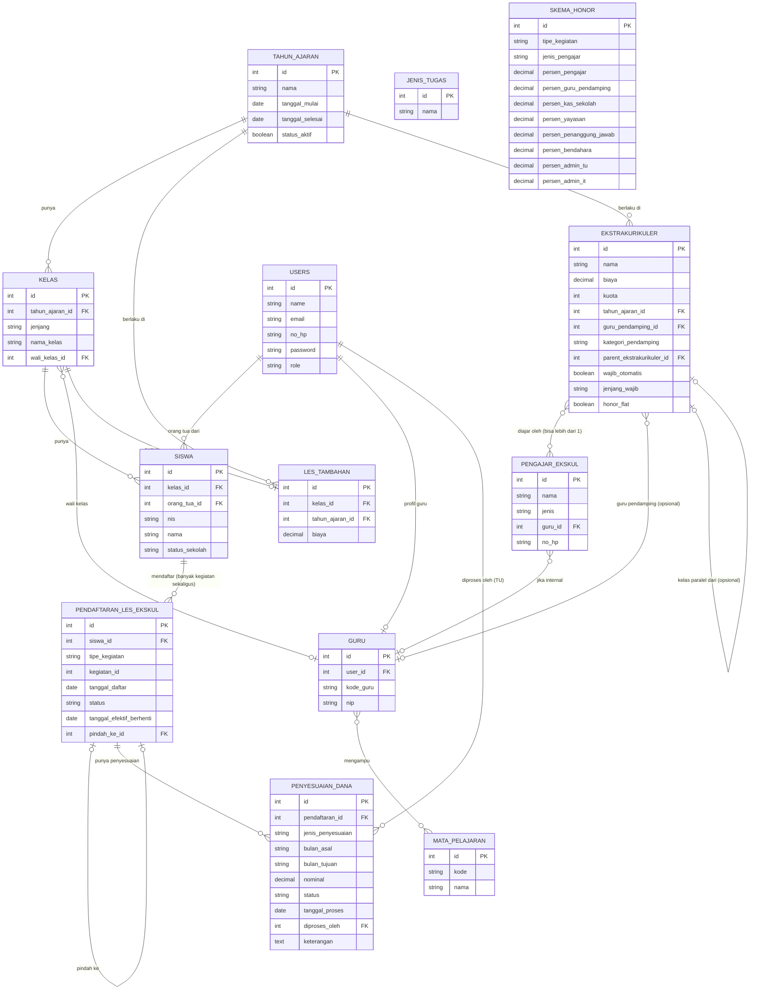

# Product Requirement Document (PRD)
## Aplikasi Jurnal Guru, Jadwal Guru, dan Les Tambahan & Ekstrakurikuler
**Klien:** SD Plus Gembala Baik — Yayasan Pendidikan Gembala Baik, Pontianak
**Versi:** 1.3 — menambahkan penanganan kegiatan wajib otomatis (Bina Karakter/Pramuka), kegiatan berkuota honor-flat (Olimpiade), dan kelas paralel ekstrakurikuler (mis. English Club, Dancing Club) beserta alur assignment oleh TU
**Tanggal:** 19 September 2026
**Tim Pengembang:** 2 orang (pembagian modul dijelaskan di Bagian B)

---

# BAGIAN A — FONDASI BERSAMA

## A1. Latar Belakang & Tujuan

Yayasan Pendidikan Gembala Baik saat ini menjalankan beberapa proses secara manual di SD Plus Gembala Baik:

- Pencatatan transaksi harian & rekap bulanan untuk les tambahan dan ekstrakurikuler masih menggunakan buku tulis dan Excel terpisah.
- Verifikasi pembayaran transfer dilakukan lewat chat pribadi antar staf, rawan bukti transfer hilang atau tidak terkirim.
- Pendaftaran les tambahan & ekstrakurikuler menggunakan Google Form, rawan pendaftaran dobel dan sulit melacak revisi data.
- Belum ada kanal resmi bagi guru untuk menyampaikan masukan/keluhan ke kepala sekolah.
- Sistem jadwal mengajar guru dari vendor sebelumnya hanya mendukung jam mengajar utama, tidak mendukung jam piket dan jam damping.

Tujuan aplikasi ini adalah mendigitalisasi keempat proses di atas dalam satu sistem terpadu, dengan validasi otomatis untuk mengurangi kesalahan pencatatan manual.

## A2. Ruang Lingkup

**4 modul utama:**

| Modul | Deskripsi Singkat | Penanggung Jawab |
|---|---|---|
| Les & Ekstrakurikuler | Pendaftaran + pencatatan transaksi & rekap bulanan | Pengembang 1 |
| Jurnal Guru | Forum privat guru–kepala sekolah + lihat jadwal pribadi | Pengembang 1 |
| Jadwal Guru | Kisi-kisi tugas mengajar + penjadwalan (utama, piket, damping) | Pengembang 2 |

**Out of scope untuk versi ini:**
- Pembayaran langsung di aplikasi (payment gateway) — direncanakan fase berikutnya
- Notifikasi real-time / chat langsung pada forum guru
- Auto-scheduling untuk jam piket & damping (cukup manual di versi ini)
- **Bina Karakter & Pramuka** — kegiatan wajib, auto-assign per jenjang kelas (bukan pilihan pendaftaran), dibiayai dari kas sekolah terpisah, honor penerima ditentukan manual oleh Kepala Sekolah secara luring; **tidak** tercatat di `pendaftaran_les_ekskul` sama sekali, murni tampilan informasi di sisi orang tua — lihat A4 & FR-24
- Honor flat untuk kegiatan non-les/ekskul (Pramuka, Bina Karakter) — dibiayai dari kas sekolah terpisah, penerima ditentukan manual oleh Kepala Sekolah secara luring; tidak memakai skema persentase dan tidak tercakup di versi ini (khusus perhitungan/pembagian honornya — lihat catatan Olimpiade di FR-25 untuk kasus yang tetap tercakup)

## A3. Role & Permission

| Role | Les & Ekskul – Pendaftaran | Les & Ekskul – Transaksi | Les & Ekskul – Honor | Jurnal Guru | Jadwal Guru |
|---|---|---|---|---|---|
| **Kepala Sekolah** | Lihat semua | Lihat laporan (read-only) | Atur skema persen honor, tentukan guru pendamping per ekstrakurikuler, lihat rekap honor & tandai "Sudah Diketahui" | Lihat & balas semua thread | Lihat semua jadwal |
| **TU** | Input & kelola pendaftaran, kelola status berhenti/pindah & penyesuaian dana | Input transaksi, ajukan laporan untuk approval | – | – | – |
| **Bendahara** | – | Approve laporan harian & bulanan | Approval bulanan memicu perhitungan honor otomatis; tidak ada input manual dari Bendahara di sini | – | – |
| **Guru** | – | – | – | Kirim pesan privat ke kepala sekolah, lihat thread sendiri | Lihat jadwal mengajar sendiri |
| **Orang Tua** | Daftarkan anak, lihat status pendaftaran | Lihat status pembayaran & tunggakan anak | – | – | – |

## A4. Data Master Bersama & ERD Awal

**Entitas inti:**

- **users** — id, name, email (nullable, untuk staf), no_hp (username untuk role orang_tua), password, role (kepala_sekolah / tu / bendahara / guru / orang_tua)
- **guru** — id, user_id (FK), kode_guru, nip
- **mata_pelajaran** — id, kode, nama
- **guru_mata_pelajaran** *(pivot N–N)* — guru_id, mapel_id
- **tahun_ajaran** — id, nama, tanggal_mulai, tanggal_selesai, status_aktif
- **kelas** — id, tahun_ajaran_id (FK), jenjang, nama_kelas, wali_kelas_id (FK → guru)
- **siswa** — id, kelas_id (FK), orang_tua_id (FK → users), nis, nama, status_sekolah (aktif/pindah_sekolah/lulus)
- **jenis_tugas** — id, nama (Mengajar Utama, Piket, Damping) — dipakai oleh Modul Jadwal Guru
- **les_tambahan** — id, kelas_id (FK), tahun_ajaran_id (FK), biaya *(pengajar = wali_kelas dari kelas terkait, tidak disimpan terpisah; tanpa kolom kuota)*
- **ekstrakurikuler** — id, nama, biaya, kuota, tahun_ajaran_id (FK), guru_pendamping_id (FK → guru, nullable), kategori_pendamping (seni/olahraga, nullable — diisi manual oleh Kepala Sekolah per kegiatan), **parent_ekstrakurikuler_id** (FK → `ekstrakurikuler.id` sendiri, nullable — diisi hanya jika baris ini adalah kelas paralel dari kegiatan induk; baris induk selalu NULL di kolom ini — lihat A4 catatan kelas paralel & B.1 FR-26/FR-27), **wajib_otomatis** (boolean, default false — true khusus untuk kegiatan seperti Bina Karakter/Pramuka yang auto-assign per jenjang kelas, lihat FR-24), **jenjang_wajib** (nullable, format rentang kelas mis. "1-3"/"4-6" — hanya diisi jika `wajib_otomatis` = true, menentukan kelas mana yang otomatis di-assign), **honor_flat** (boolean, default false — true untuk kegiatan seperti Olimpiade yang tetap terdaftar & berkuota tapi honornya di luar `skema_honor` persentase, ditentukan manual Kepala Sekolah — lihat FR-25)
- **pengajar_ekskul** — id, nama, jenis (internal/eksternal), guru_id (FK → guru, nullable), no_hp
- **ekstrakurikuler_pengajar** *(pivot N–N)* — ekstrakurikuler_id, pengajar_ekskul_id *(satu kegiatan bisa punya lebih dari 1 pengajar, mis. English Club 6 orang; honor pengajar dibagi rata sesuai jumlah baris di sini)*
- **skema_honor** — id, tipe_kegiatan (ekstrakurikuler/les_tambahan), jenis_pengajar (internal/eksternal, nullable — khusus ekstrakurikuler), persen_pengajar, persen_guru_pendamping (nullable), persen_kas_sekolah, persen_yayasan (nullable — khusus les_tambahan), persen_penanggung_jawab, persen_bendahara, persen_admin_tu, persen_admin_it *(dikelola Kepala Sekolah, bisa diubah kapan saja; perubahan hanya berlaku untuk perhitungan bulan berikutnya karena bulan yang sudah dihitung tersimpan sebagai snapshot — lihat `honor_kegiatan` di B.1)*
- **pendaftaran_les_ekskul** — id, siswa_id (FK), tipe_kegiatan (les_tambahan/ekstrakurikuler), kegiatan_id (menunjuk ke `les_tambahan.id` atau `ekstrakurikuler.id` sesuai `tipe_kegiatan`, dicocokkan di level aplikasi — bukan FK langsung, sama seperti `skema_honor`), tanggal_daftar, status (aktif/berhenti/pindah), tanggal_efektif_berhenti (nullable), pindah_ke_id (FK ke `pendaftaran_les_ekskul.id` sendiri, nullable, diisi hanya jika status = pindah). *Satu siswa bisa memiliki banyak baris sekaligus — contoh: les tambahan + ekstra basket + ekstra renang + ekstra English Club, masing-masing baris independen dengan status sendiri-sendiri.*
- **penyesuaian_dana** — id, pendaftaran_id (FK → `pendaftaran_les_ekskul`), jenis_penyesuaian (alih_kegiatan/kelebihan_transfer/kegiatan_tidak_berlangsung/refund_berhenti), bulan_asal, bulan_tujuan (nullable, kosong jika jenisnya refund), nominal, status (selesai/proses/berhasil — makna berbeda tergantung `jenis_penyesuaian`: alih_kegiatan & kegiatan_tidak_berlangsung selalu langsung "selesai", refund_berhenti bisa "proses" dulu baru "berhasil"), tanggal_proses, diproses_oleh (FK → users, TU yang input), keterangan (nullable, catatan bebas)

**Catatan tambahan v1.3 — Kelas Paralel Ekstrakurikuler:**

Beberapa ekstrakurikuler (mis. English Club, Dancing Club) memiliki peminat yang banyak sehingga dipecah menjadi beberapa kelas paralel oleh pengajarnya sendiri (mis. English Club → Starter/Mover/Flyer; Dancing Club → Class A/B/C). Pembagian ini **tidak ditentukan di awal oleh sistem**, melainkan oleh pengajar setelah melihat jumlah pendaftar.

- Setiap kelas paralel disimpan sebagai baris `ekstrakurikuler` tersendiri (dengan kuota, jadwal, ruangan masing-masing), yang menunjuk ke baris induk lewat `parent_ekstrakurikuler_id`.
- Baris **induk** (mis. "English Club — Jumat") adalah satu-satunya yang ditampilkan & dipilih orang tua saat pendaftaran; baris **paralel** tidak muncul di form pendaftaran ortu.
- Alur dua tahap: (1) orang tua daftar ke kegiatan induk lewat `pendaftaran_les_ekskul.kegiatan_id` = id induk; (2) TU, setelah koordinasi dengan pengajar, memindahkan `kegiatan_id` pendaftaran tersebut ke id kelas paralel yang sesuai — lihat FR-26 & FR-27.
- Kuota & cek bentrok jadwal (FR-4, FR-5) dievaluasi di level kelas paralel setelah siswa di-assign; sebelum di-assign, kuota yang relevan adalah total gabungan seluruh kelas paralel di bawah induk yang sama.

**Catatan tambahan v1.3 — Kegiatan Wajib Otomatis vs Kegiatan Berkuota Honor-Flat:**

Ada dua kasus kegiatan di luar skema honor persentase biasa, dengan penanganan sistem yang berbeda:

| | Bina Karakter & Pramuka | Olimpiade (MTK/IPA/IPS) |
|---|---|---|
| Sifat pendaftaran | Wajib, auto-assign per jenjang kelas | Pilihan, ada kuota/limit pendaftar |
| Tercatat di `pendaftaran_les_ekskul`? | **Tidak** | **Ya** (biaya = 0) |
| Tampilan di sisi Orang Tua | Read-only, info "Kegiatan Wajib (Otomatis)" | Pilihan aktif seperti ekskul lain, tapi gratis |
| Kolom penanda di `ekstrakurikuler` | `wajib_otomatis` = true, `jenjang_wajib` diisi | `honor_flat` = true, `biaya` = 0 |
| Honor | Flat, di luar `skema_honor`, ditentukan manual Kepala Sekolah, dari kas sekolah — di luar scope aplikasi | Flat, di luar `skema_honor`, ditentukan manual Kepala Sekolah — di luar scope aplikasi |

**ERD:**

*Catatan: `jenis_tugas` belum dihubungkan ke entitas lain di ERD ini karena tabel yang menggunakannya (alokasi piket, alokasi damping, jadwal mengajar) adalah data milik Modul Jadwal Guru, dirancang lebih detail di Bagian B.3.*

*Catatan: `skema_honor` dan `pendaftaran_les_ekskul.kegiatan_id` tidak digambar dengan garis relasi FK langsung ke `les_tambahan`/`ekstrakurikuler`, karena keduanya dicocokkan berdasarkan kolom tipe (`tipe_kegiatan`/`jenis_pengajar`) saat aplikasi berjalan, bukan lewat foreign key constraint di database. Hasil perhitungan bulanan (`honor_kegiatan`, `honor_pengajar`) adalah data milik Modul Les & Ekskul, didetailkan di B.1.*

*Tabel transaksional per modul lain (transaksi pembayaran, forum jurnal, jadwal mengajar) didetailkan di Bagian B masing-masing modul, tidak termasuk di data master bersama ini.*

## A5. Arsitektur & Keputusan Teknis

- **Pola arsitektur:** Modular monolith — 1 aplikasi, 1 database, 1 sistem login, tapi kode dipecah per domain (`app/Domains/LesEkskul`, `app/Domains/JurnalGuru`, `app/Domains/JadwalGuru`) agar 2 developer bisa bekerja paralel tanpa saling tabrak.
- **Backend:** Laravel.
- **Frontend:** React, diintegrasikan lewat **Inertia.js** (bukan REST API terpisah) — routing & auth session tetap di Laravel, React hanya sebagai lapisan tampilan. Dipilih karena aplikasi ini adalah website application dan tim baru belajar React.
- **Antisipasi mobile app di masa depan:** logika bisnis tiap modul ditulis di Service/Action class terpisah dari Controller, supaya kalau nanti dibutuhkan API untuk mobile app, tinggal tambah route API + Sanctum tanpa menulis ulang logika bisnis.
- **Role & Permission:** direkomendasikan menggunakan package `spatie/laravel-permission`.
- **Database:** Supabase (hosted Postgres), diakses langsung oleh Laravel via koneksi database standar — bukan lewat fitur Auth/Realtime bawaan Supabase.
  - Free tier Supabase: 500 MB database, 1 GB file storage, 5 GB egress, tanpa backup otomatis, project auto-pause setelah 7 hari tanpa aktivitas.
  - Direkomendasikan menyiapkan backup terjadwal sendiri (mis. `pg_dump` via GitHub Actions) sebelum data produksi sungguhan masuk.
  - Upgrade ke Supabase Pro (untuk backup otomatis & tanpa pause) adalah keputusan biaya operasional yang perlu didiskusikan dengan klien saat aplikasi masuk tahap produksi.
- **Dev environment:** Docker, direkomendasikan mulai dari Laravel Sail.
- **Deployment aplikasi:** direkomendasikan Laravel Cloud atau Render untuk pengalaman deploy pertama kali (minim konfigurasi server manual), tetap bisa terhubung ke database Supabase eksternal. Biaya hosting termasuk hal yang perlu didiskusikan dengan klien.

## A6. Daftar Keputusan Terbuka

| # | Item | Perlu Diputuskan Oleh | Status |
|---|---|---|---|
| 1 | ~~Aturan prorata untuk siswa yang berhenti/gabung les tambahan di tengah bulan~~ | Klien | **Selesai — lihat B.1** |
| 2 | ~~Detail aturan "uang ekstra dialihkan ke uang buku"~~ | — | **Dihapus — tidak dibutuhkan, kebutuhan sudah tercakup oleh mekanisme auto-deduct/refund di B.1** |
| 3 | Perlu tidaknya waiting list otomatis untuk ekstrakurikuler yang kuotanya penuh | Klien / Tim | Terbuka |
| 4 | Payment gateway untuk pembayaran transfer (fase 2) | Klien | Terbuka |
| 5 | Upgrade Supabase Pro & pilihan platform hosting produksi | Klien | Terbuka |
| 6 | Detail tambahan Modul Jurnal Guru (mis. lampiran file di forum) | Tim | Terbuka |
| 7 | Detail final Modul Jadwal Guru (B.3 masih draf awal) | Pengembang 2 & Klien | Terbuka |
| 8 *(baru, v1.3)* | Apakah siswa yang belum di-assign TU ke kelas paralel (status transisi, lihat FR-27) tetap dianggap "aktif" & bisa membayar tagihan, atau perlu status sementara terpisah | Tim | Terbuka |
| 9 *(baru, v1.3)* | Apakah kelas paralel bisa berubah jumlah/nama di tengah tahun ajaran (mis. pengajar minta pecah jadi 4 kelas karena makin ramai), dan bagaimana menangani siswa yang sudah ter-assign saat itu terjadi | Klien | Terbuka |

## A7. Glosarium

- **Les Tambahan** — sesi belajar tambahan per kelas, diajar oleh wali kelas kelas tersebut.
- **Ekstrakurikuler** — kegiatan pilihan lintas kelas, bisa diajar guru internal maupun pengajar dari luar sekolah.
- **Piket** — tugas guru di luar mengajar (mis. mengawasi koridor, mengurus siswa terlambat), terikat pada slot waktu tertentu, tidak terikat kelas/mapel.
- **Damping** — guru pendamping yang menemani guru utama di kelas & jam yang sama.
- **Tutup Buku** — mekanisme penutupan pencatatan bulanan, pembayaran setelah tanggal tutup buku dianggap masuk bulan berikutnya.
- **Wali Kelas** — guru penanggung jawab satu kelas, juga bertugas sebagai pengajar les tambahan kelas tersebut.
- **Prorata** — perhitungan biaya secara proporsional sesuai durasi keikutsertaan aktual, bukan tarif bulan penuh. *(Catatan: setelah klarifikasi klien di v1.2, sistem ini **tidak** memakai prorata untuk siswa baru gabung tengah bulan — tetap bayar penuh; istilah ini dipertahankan di glosarium karena masih relevan untuk memahami mengapa aturan itu perlu ditegaskan.)*
- **Skema Honor** — aturan persentase pembagian pendapatan kegiatan les/ekstrakurikuler ke berbagai pihak (pengajar, guru pendamping, kas sekolah, yayasan, penanggung jawab, pengelola), bisa diubah kapan saja oleh Kepala Sekolah.
- **Guru Pendamping (Ekstrakurikuler)** — guru tambahan yang mendampingi kegiatan tertentu (kategori seni atau olahraga), ditentukan manual oleh Kepala Sekolah, mendapat 5% dari total pembayaran kegiatan tersebut.
- **Penanggung Jawab** — porsi 7% (ekstrakurikuler) / 1% (les tambahan) dari total pembayaran untuk pihak penanggung jawab kegiatan.
- **Pengelola** — porsi honor untuk Bendahara, Admin TU, dan Admin IT, masing-masing dengan persentase tersendiri di dalam `skema_honor`.
- **Penyesuaian Dana** — mekanisme sistem untuk menyelesaikan selisih uang akibat kelebihan transfer, pemberhentian, perpindahan kegiatan, atau kegiatan yang tidak berlangsung; selalu diselesaikan lewat pengalihan ke bulan berikutnya atau refund — sistem tidak pernah menyimpan saldo lebih sebagai kredit mengambang.
- **Kegiatan Wajib Otomatis** *(baru, v1.3)* — ekstrakurikuler yang otomatis diikuti seluruh siswa pada jenjang kelas tertentu tanpa proses pendaftaran (mis. Bina Karakter untuk kelas 1-3, Pramuka untuk kelas 4-6); ditandai lewat kolom `wajib_otomatis` & `jenjang_wajib`, tidak tercatat di `pendaftaran_les_ekskul`.
- **Kegiatan Berkuota Honor-Flat** *(baru, v1.3)* — ekstrakurikuler gratis (biaya = 0) yang tetap melalui alur pendaftaran & pembatasan kuota normal, namun honor pengajarnya flat dan ditentukan manual Kepala Sekolah, di luar `skema_honor` persentase (mis. Olimpiade MTK/IPA/IPS); ditandai lewat kolom `honor_flat`.
- **Kelas Paralel** *(baru, v1.3)* — pembagian satu ekstrakurikuler induk menjadi beberapa kelas terpisah (jadwal/ruangan/kuota masing-masing) karena jumlah peminat tinggi, ditentukan oleh pengajar kegiatan tersebut; orang tua mendaftar ke kegiatan induk, TU yang kemudian meng-assign siswa ke kelas paralel spesifik. Direpresentasikan lewat kolom `parent_ekstrakurikuler_id` pada tabel `ekstrakurikuler`.

---

# BAGIAN B — PER MODUL

## B.1 Modul Les & Ekstrakurikuler (Pengembang 1)

**Deskripsi & Tujuan**
Menangani pendaftaran les tambahan & ekstrakurikuler, plus pencatatan transaksi pembayaran harian dan rekap bulanan — menggantikan pencatatan manual dengan alur tercatat rapi, verifikasi cash/transfer jelas, dan rekap otomatis per periode custom.

**User Flow**

*Sub-alur Pendaftaran:*
Orang tua login (no HP) → pilih anak (atau daftar anak baru) → sistem tampilkan info kegiatan wajib otomatis (Bina Karakter/Pramuka, read-only, sesuai jenjang kelas anak — lihat FR-24) → orang tua pilih ekstrakurikuler/les tambahan tahun ajaran aktif dari kegiatan yang tersedia untuk dipilih, termasuk kegiatan berkuota honor-flat seperti Olimpiade (bisa lebih dari satu kegiatan sekaligus, masing-masing tercatat sebagai baris `pendaftaran_les_ekskul` terpisah; untuk ekstrakurikuler yang punya kelas paralel, orang tua hanya melihat & memilih kegiatan induknya — lihat FR-26) → sistem cek duplikasi (siswa + kegiatan yang sama) & cek kuota (khusus ekstrakurikuler, termasuk kegiatan berkuota honor-flat) & cek bentrok jadwal → TU bisa input manual untuk yang telat/luring → khusus kegiatan berkelas-paralel, TU assign siswa dari kegiatan induk ke kelas paralel spesifik setelah koordinasi dengan pengajar (lihat FR-27).

*Sub-alur Transaksi & Rekap:*
Cash di loket → TU input, langsung approved. Transfer → ortu kirim bukti → TU catat status "pending" → TU cocokkan ke mutasi rekening → ubah "verified". Laporan harian: sistem generate laporan untuk approval TU → Bendahara (Kepala Sekolah bisa melihat laporan, bukan approver). Bulanan: rekap per periode custom + mekanisme tutup buku → setelah Bendahara approve laporan bulanan, sistem otomatis hitung pembagian honor per kegiatan berdasarkan `skema_honor` yang berlaku, lalu rekap per orang → Kepala Sekolah lihat rekap honor & tandai "Sudah Diketahui" (tanpa opsi tolak di aplikasi; koreksi dilakukan langsung ke Bendahara secara luring). Orang tua login untuk cek status & tunggakan.

*Sub-alur Pemberhentian, Perpindahan & Penyesuaian Dana:*
TU mengubah status baris `pendaftaran_les_ekskul` siswa dari `aktif` menjadi `berhenti` atau `pindah` sesuai aturan tiap tipe kegiatan (lihat FR-10 & FR-11). Setiap kali perubahan ini berdampak pada uang yang sudah dibayar (alih kegiatan, kegiatan tidak berlangsung, kelebihan transfer, atau refund akibat berhenti), sistem mencatat satu baris baru di `penyesuaian_dana` yang terhubung ke pendaftaran terkait, sehingga riwayat penyesuaian dana per siswa per kegiatan selalu bisa ditelusuri tanpa perlu tabel riwayat terpisah.

**Functional Requirements**

- FR-1: Orang tua registrasi (no HP) & login
- FR-2: Daftarkan anak ke les tambahan (otomatis sesuai kelas) dan/atau ekstrakurikuler pilihan — satu anak bisa terdaftar di banyak kegiatan sekaligus (les tambahan + beberapa ekstrakurikuler berbeda)
- FR-3: Deteksi duplikasi pendaftaran anak ke kegiatan yang sama (kombinasi siswa + kegiatan); izinkan anak berbeda dengan no HP sama, dan izinkan satu anak terdaftar di banyak kegiatan berbeda
- FR-4: Cegah pendaftaran ekstrakurikuler yang sudah penuh kuota (berlaku juga untuk kegiatan berkuota honor-flat seperti Olimpiade; untuk kegiatan berkelas-paralel, kuota yang dicek sebelum di-assign TU adalah kuota gabungan seluruh kelas paralel di bawah kegiatan induk yang sama — lihat FR-26)
- FR-5: Deteksi bentrok jadwal ekstrakurikuler untuk anak yang sama
- FR-6: TU input pendaftaran manual (kasus telat/luring)
- FR-7: TU catat transaksi cash (auto-approved) atau transfer (upload bukti, status pending)
- FR-8: TU ubah status transfer pending → verified
- FR-9: Hitung tagihan otomatis per anak, termasuk diskon 50% untuk anak dari guru yang bekerja di SD Plus (berlaku untuk les tambahan **dan** ekstrakurikuler; tidak berlaku untuk guru unit yayasan lain maupun pengajar ekskul eksternal); siswa yang baru gabung di tengah bulan tetap membayar penuh 1 bulan (tanpa prorata)
- FR-10: Tangani pemberhentian les tambahan/ekstrakurikuler:
  - **Les tambahan** — dapat diberhentikan kapan saja; jika diberhentikan pada bulan yang sudah dibayar, pembayaran bulan tersebut hangus (tidak direfund)
  - **Ekstrakurikuler** — pemberhentian/perpindahan hanya efektif pada pergantian semester, **kecuali** di bulan pertama semester berjalan, di mana pemberhentian/perpindahan tengah semester masih diizinkan
- FR-11: Tangani perpindahan kegiatan (les tambahan maupun ekstrakurikuler, mengikuti batasan waktu di FR-10):
  - Jika biaya kegiatan lama dan kegiatan baru **sama**, dan bulan berjalan sudah lunas dibayar → saldo bulan tersebut langsung dialihkan ke kegiatan baru
  - Jika biaya kegiatan lama dan kegiatan baru **berbeda** → tidak dapat langsung pindah bulan itu juga; kegiatan lama harus diselesaikan/dilunasi dulu sampai akhir bulan berjalan, kegiatan baru baru efektif mulai bulan berikutnya
- FR-12: Generate laporan harian untuk approval TU → Bendahara, dapat dilihat Kepala Sekolah
- FR-13: Generate rekap bulanan periode custom + honor pengajar
- FR-14: Mekanisme tutup buku bulanan
- FR-15: Orang tua lihat status pembayaran & tunggakan
- FR-16: Sistem hitung otomatis pembagian honor per kegiatan (ekstrakurikuler & les tambahan) berdasarkan `skema_honor` yang berlaku, dipicu setelah Bendahara approve laporan bulanan
- FR-17: Kepala Sekolah atur persentase `skema_honor` per tipe kegiatan (dan jenis pengajar internal/eksternal untuk ekstrakurikuler), berlaku sejak diubah — tidak mengubah perhitungan bulan-bulan sebelumnya
- FR-18: Kepala Sekolah tentukan guru pendamping (opsional) & kategori seni/olahraga per ekstrakurikuler, secara manual per kegiatan
- FR-19: Sistem rekap honor per orang per bulan, menggabungkan seluruh peran orang tersebut (pengajar di satu atau lebih kegiatan, guru pendamping, dan/atau posisi pengelola)
- FR-20: Kepala Sekolah lihat rekap honor per kegiatan & per orang, lalu tandai "Sudah Diketahui" (murni acknowledgment, tanpa opsi tolak/revisi di aplikasi)
- FR-21 *(baru)*: Sistem deteksi kelebihan pembayaran transfer (nominal masuk lebih besar dari tagihan) → kelebihan tersebut otomatis mengurangi tagihan bulan berikutnya untuk kegiatan yang sama; tidak ada opsi refund tunai untuk kasus ini
- FR-22 *(baru)*: Sistem proses refund untuk pembayaran di muka (multi-bulan) saat siswa berhenti di tengah periode yang sudah dibayar — bulan-bulan **setelah** bulan pemberhentian yang sudah terlanjur dibayar akan direfund; bulan pemberhentian itu sendiri tidak direfund (mengikuti aturan hangus di FR-10). Refund memiliki status proses (`proses` → `berhasil`) yang dikelola TU
- FR-23 *(baru)*: TU dapat menandai satu kegiatan spesifik (satu les tambahan atau satu ekstrakurikuler tertentu, bukan per kategori) sebagai "tidak berlangsung" pada bulan tertentu → pembayaran yang sudah dilakukan untuk kegiatan tersebut di bulan itu otomatis dialihkan menjadi pelunasan bulan berikutnya; kegiatan lain yang tetap berjalan normal pada bulan yang sama tidak terpengaruh
- FR-24 *(baru, v1.3)*: Sistem tampilkan kegiatan wajib otomatis (Bina Karakter untuk kelas 1-3, Pramuka untuk kelas 4-6) sebagai informasi read-only di halaman orang tua, berdasarkan `jenjang_wajib` pada baris `ekstrakurikuler` yang `wajib_otomatis` = true dan kelas anak yang login; kegiatan ini **tidak** memerlukan aksi pendaftaran dari orang tua dan **tidak** menghasilkan baris di `pendaftaran_les_ekskul`
- FR-25 *(baru, v1.3)*: Sistem tangani kegiatan berkuota honor-flat (mis. Olimpiade MTK/IPA/IPS) dengan alur pendaftaran, deteksi duplikasi, dan cek kuota yang identik dengan ekstrakurikuler biasa (lihat FR-2 s/d FR-5), dibedakan hanya lewat `biaya` = 0 dan `honor_flat` = true pada baris `ekstrakurikuler`-nya; kegiatan ini **tetap** tercatat di `pendaftaran_les_ekskul` dan ikut proses laporan/rekap pendaftaran, namun **tidak** ikut perhitungan otomatis `skema_honor` (FR-16) karena honornya flat & ditentukan manual Kepala Sekolah di luar aplikasi
- FR-26 *(baru, v1.3)*: Untuk ekstrakurikuler yang memiliki kelas paralel (mis. English Club, Dancing Club), sistem hanya menampilkan & mengizinkan pendaftaran ke baris `ekstrakurikuler` induk (`parent_ekstrakurikuler_id` = NULL) di sisi orang tua; baris-baris kelas paralel (`parent_ekstrakurikuler_id` menunjuk ke induk) tidak muncul di form pendaftaran orang tua
- FR-27 *(baru, v1.3)*: TU dapat memindahkan pendaftaran siswa dari kegiatan induk berkelas-paralel ke salah satu kelas paralel spesifiknya (mengubah `pendaftaran_les_ekskul.kegiatan_id` dari id induk menjadi id kelas paralel terpilih), dengan validasi kuota kelas paralel tujuan; dilakukan lewat modal/section tambahan pada halaman Kelola Pendaftaran TU

**Data yang Dimiliki:** `pendaftaran_les_ekskul` (kini mencakup status aktif/berhenti/pindah), `penyesuaian_dana` (baru — mencatat alih kegiatan, kelebihan transfer, kegiatan tidak berlangsung, dan refund berhenti), `transaksi_pembayaran`, snapshot laporan harian/bulanan, pengaturan tutup buku, `honor_kegiatan` (snapshot hasil hitung per kegiatan per bulan), `honor_pengajar` (rekap per orang per bulan + status "Sudah Diketahui")

**Dependency:** ke data master bersama (siswa, kelas, orang tua, guru, ekstrakurikuler, les_tambahan, pengajar_ekskul, skema_honor) — tidak ada dependency ke 2 modul lain

**Kasus Khusus:**
- Siswa berhenti/masuk tengah bulan (lihat FR-9, FR-10)
- Pindah ekstra dengan biaya sama vs berbeda (lihat FR-11)
- Anak guru SD Plus bayar 50% (les tambahan & ekstrakurikuler)
- Kelebihan transfer & kombinasi kelebihan transfer + pemberhentian dalam satu siklus pembayaran (lihat FR-21, FR-22) — sistem tidak pernah menyimpan saldo mengambang, selalu diselesaikan lewat auto-deduct bulan berikutnya atau refund
- Ortu tidak kirim bukti transfer
- Ekstrakurikuler dengan lebih dari 1 pengajar (honor dibagi rata)
- `skema_honor` diubah di tengah tahun ajaran (tidak memengaruhi bulan yang sudah dihitung karena tersimpan sebagai snapshot)
- Kegiatan spesifik libur/tidak berlangsung sebulan penuh sementara kegiatan lain tetap berjalan normal (lihat FR-23) — granularitas per kegiatan, bukan per kategori les/ekskul
- Kegiatan wajib otomatis (Bina Karakter/Pramuka) tidak pernah muncul di rekap pendaftaran/transaksi karena memang tidak tercatat di `pendaftaran_les_ekskul` (lihat FR-24)
- Kegiatan berkuota honor-flat (Olimpiade) muncul di rekap pendaftaran seperti ekskul biasa, tapi harus dikecualikan dari laporan rekap honor persentase (FR-19/FR-20) agar tidak salah dihitung
- Siswa terdaftar di kegiatan induk berkelas-paralel tapi belum di-assign TU ke kelas paralel manapun (status transisi sebelum FR-27 dijalankan) — perlu indikator jelas di UI TU supaya tidak terlewat

**Out of Scope versi ini:** payment gateway (lihat A6 #4), waiting list otomatis (lihat A6 #3)

---

## B.2 Modul Jurnal Guru (Pengembang 1)

**Deskripsi & Tujuan:** Forum privat guru ↔ kepala sekolah, plus tampilan jadwal mengajar pribadi guru.

**User Flow:** Guru login → lihat jadwal mengajarnya (read-only, dari Modul Jadwal Guru) → tulis pesan/keluhan ke forum privatnya. Kepala sekolah login → lihat semua thread per guru → balas.

**Functional Requirements**

- FR-1: Guru lihat jadwal mengajarnya sendiri
- FR-2: Guru kirim pesan ke forum privat
- FR-3: Kepala sekolah lihat & balas semua thread
- FR-4: Guru hanya akses thread miliknya sendiri

**Data yang Dimiliki:** `forum_pesan` (guru_id, pengirim, isi, tanggal)

**Dependency:** butuh baca data jadwal dari Modul Jadwal Guru — format integrasi (query langsung/service) perlu disepakati dengan Pengembang 2

**Kasus Khusus:** belum ada detail lain dari wawancara — kemungkinan perlu digali lagi bila ada requirement tambahan

**Out of Scope:** notifikasi real-time/chat langsung — cukup model post & reply dulu (lihat A6 #6)

---

## B.3 Modul Jadwal Guru (Pengembang 2) — draf awal, perlu dikonfirmasi

**Deskripsi & Tujuan:** Kisi-kisi pembagian tugas + penjadwalan aktual, ditambah jenis tugas baru (piket & damping) yang tidak didukung sistem vendor lama.

**User Flow (referensi vendor lama + penyesuaian):** isi Waktu Pelajaran → isi Kisi-Kisi Mengajar Utama (guru×kelas×mapel×jam) → isi alokasi Piket (guru×slot waktu, tidak terikat kelas/mapel) → isi alokasi Damping (guru pendamping×kelas/jam yang sudah ada guru utama) → jadwal manual/auto-scheduling khusus jam mengajar utama.

**Functional Requirements**

- FR-1: Master data waktu pelajaran per tahun ajaran
- FR-2: Kisi-kisi mengajar utama, tervalidasi kuota jam per kelas
- FR-3: Alokasi piket per guru per slot waktu, terpisah dari kuota jam mengajar
- FR-4: Alokasi damping per guru per kelas/jam yang sudah ada guru utama, tanpa melanggar aturan "1 guru 1 kelas per jam" untuk jam utama
- FR-5: Penjadwalan manual & auto-scheduling untuk jam mengajar utama
- FR-6: Validasi anti-bentrok guru pada jam mengajar utama
- FR-7: Export/import Excel sebagai checkpoint *(opsional)*

**Data yang Dimiliki:** `waktu_pelajaran`, `kisi_kisi_tugas`, `jadwal_mengajar`, `alokasi_piket`, `alokasi_damping`

**Dependency:** dibaca oleh Modul Jurnal Guru; pakai data master guru/kelas/mapel/jenis_tugas dari fondasi bersama

**Kasus Khusus:** guru dengan banyak mapel di kelas sama/beda; guru damping "menumpuk" di slot yang sudah terisi guru utama

**Out of Scope:** auto-scheduling untuk piket & damping (lihat A6 #7)
